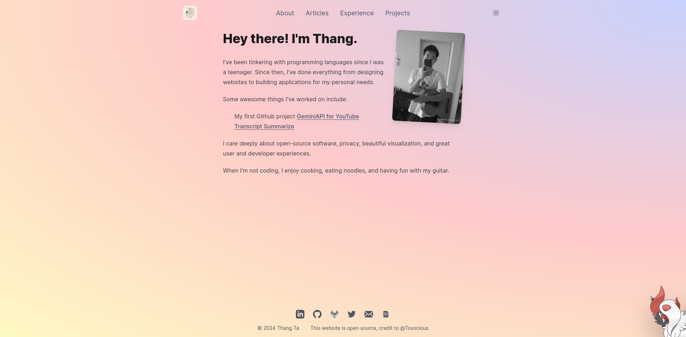

  
    

  <h1 align="center">My Personal Website</h1>

  A personal website is a pretty important thing to have as a software engineer, so I wanted to put something together that would match what I envision and want in a personal website &mdash; an outlet for me to describe myself and the things that I've worked on, while occasionally dumping my brain in a blog article or two.

  It comes with beautiful gradients, outstanding typography, mobile responsiveness, and a small personal touch with a nice Pokemon decal; what more could I possibly want?

  If you're interested in using this repository as a template, please consider forking it and leaving a star.

  
  
  
  
  

# Table of Contents
- [Table of Contents](#table-of-contents)
- [Screenshots](#screenshots)
- [About The Project](#about-the-project)
  - [Tech Stack](#tech-stack)
  - [Features](#features)
  - [Updating To Fit Your Information](#updating-to-fit-your-information)
  - [Error Handling in Workflow](#error-handling-in-workflow)
- [License](#license)

# Screenshots

  

    
Desktop Previews

    
    
    
    
    
    
    
    
    
    
  

   

  

    
Mobile Previews

    
    
    
    
    
    
    
    
    
    
  

# License
Licensed under GNU GPL 3.

For more information, check out [LICENSE](LICENSE).
